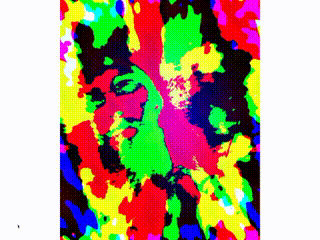
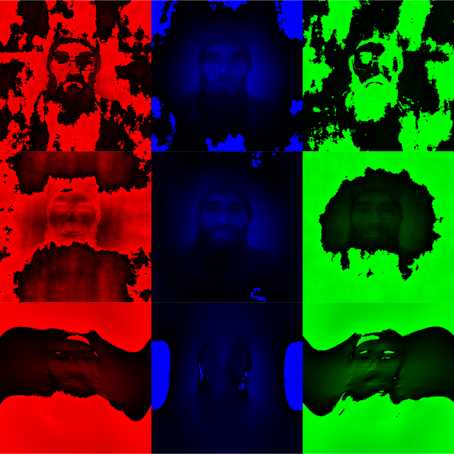

# colourizing in the frequency domain

hopefully a series of experiments assigning colours based on information in the frequency domain. first up: colour-by-angle.

The frequency-domain information is copied to three different frequency domain images based on the angle of the bin. Some multiple of two rotations through the colour spectrum is used for this mapping. (two rotations maintains pixels on opposite sides of the zero frequency getting copied the same way. something something maintaining symmetry in the frequency domain makes sure you get only real outputs from the inverse transform...).

The three partial frequency domain images are then inversed back to real images, and finally merged into one image, with each output getting assigned to the red, green, and blue channels, respectively.

The separated images look like this: (each row is a different number of rotations through the spectrum)

