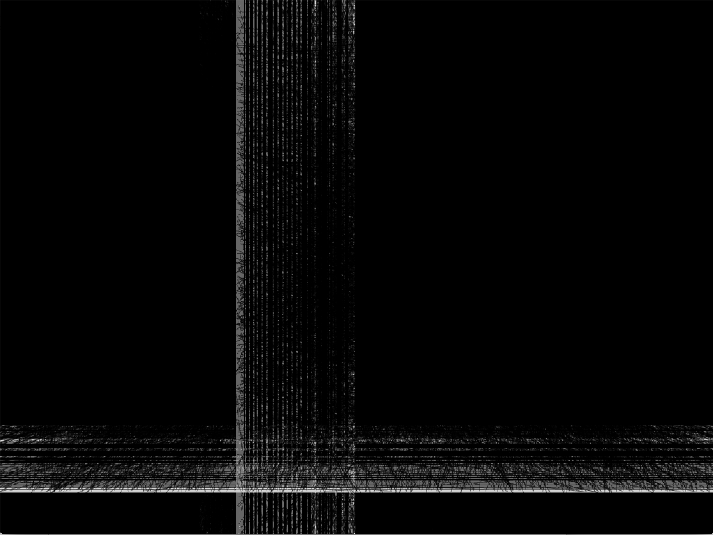

# noise from noise

1. generate white noise
2. filter in the frequency domain to let certain pitches through
3. control the filter with the mouse and play it back over speakers

- move the mouse down near the bottom of the window to filter more aggressively
- left/right mouse position sets the frequencies the the filter lets through: left is low sounds, right is high sounds. (right-most sound is the highest C8 note on a normal piano)
