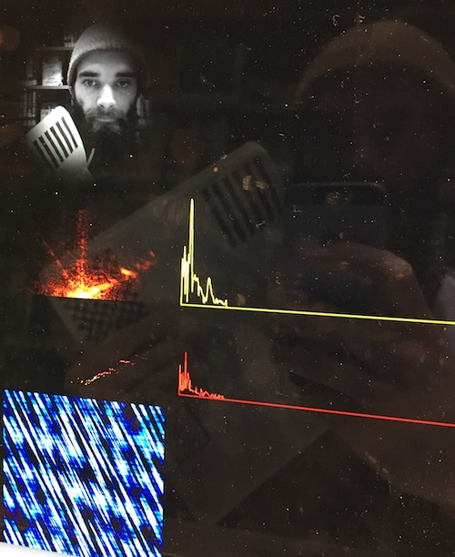

# sounds from webcam

an attempt at meaningfully (whatever that means) transforming video data into sound:

- webcam image is processed with a 2d fourier transform into the frequency domain
- each bin in the frequency domain is search to find the higest amplitude for every frequency (ignoring angle). These highest-per-frequency bin amplitudes are copied into a 1d array of [amplitude, angle] pairs.
- this 1d/linear set of frequency bin + angle pairs are then used to
    1. recreate an image with only this information (blue weird texture thing at the bottom)
    2. synthesize chunks of audio with a 1d inverse fourier transform (two transforms are actually run, the angle information is used to pan frequency bins left/right for stereo audio)

## results

synthesizing audio with an inverse fourier transform is hard and messy: each transform creates a chunk of audio, and these chunks are discontinuous, so there's an awful periodic artifact that sounds like a buzz with frequency determined by the sound device sampling rate and image size (which determinse how many frequency bins are available / the frequencies of the bins).

throwing away most of the information from the image creates an output image that is (surprise) mostly garbage in terms of recognizeable patterns from the input. HOWEVER! strong repeating patterns transform into strong frequency bins, and tend to make it through. Asad called it an "anti-selfie filter", which is kind of great.

# things to try

- maybe average across the image frequency bins instead of taking the maximum?

- phase information from the image transform is not considered, just magnitude. the bins in each audio inverse transform are all set to phase zero. If the phase of every bin was tracked and set so that each new transform started from the phase the last one left off, it might reduce some of the periodic noise.

- might be cool to do audio synthesis as a one-shot, single-frame process: much higher resolution images, and interpolated data in the frequency and/or time domain for the audio could stretch the created information out to a meaningful length. then there wouldn't be periodic artifacts to worry about.

- make it more pitch-centric? do something like light-organ frequency-grouping fromt he image to mix the information down into something much simpler before synthesizing audio, maybe with additive synthesis.

- make it a phone app! there are actually lots of repeating patterns everywhere in the built world. It's hard to get them in frame with a webcam, but a phone camera may be perfect to find a) texturest that make it through visually and b) create distinctive sounds!
