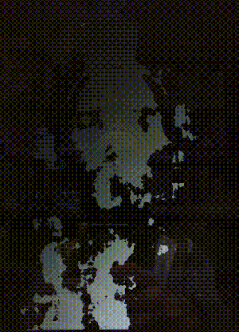

# noise filtered by webcam

1. generate white noise
2. transform it to the frequency domain
3. transform webcam image to frequency domain
4. scale noise frequency bins by their dot product with the corresponding webcam freq bins
5. inverse-transform the noise back to an image

another "filter noise to find things we're looking for in it" experiment

it's sort of pretty, and has some neat behaviours. it's also complicated and math-y and a lot less accessible for those reasons. I want to either get better at describing what's going on (what it does vs how it does it?) or probably abandon this line of experiments.
